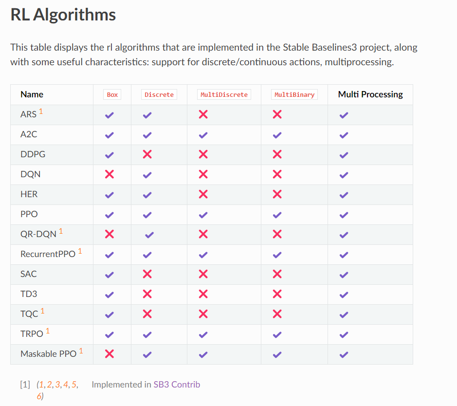

# Reinforcement Learning Algorithms
This document details the progress and examples of various reinforcement learning algorithms, indicating which have been implemented and visualizing their effects through before and after training scenarios.
## Table of Contents
1. [Implemented Algorithms](#implemented-algorithms)
2. [DQN (Deep Q Learning)](#dqn-deep-q-learning)
3. [SAC (Soft Actor-Critic)](#sac-soft-actor-critic)
## Implemented Algorithms
- [x] DQN (Deep Q Learning)
- [x] DDPG (Deep Deterministic Policy Gradient)
- [ ] PPO (Proximal Policy Optimization)
- [ ] SAC (Soft Actor-Critic)
- [ ] TD3 (Twin Delayed Deep Deterministic Policy Gradient)

## DQN (Deep Q Learning)
Deep Q Learning is used for decision making in discrete action spaces. Below are examples of its application:

### LunarLander-v2
[LunarLander-v2 Environment](https://gymnasium.farama.org/environments/box2d/lunar_lander/)

#### Before Training

#### After Training

#### Training Curve

### FrozenLake-v1 (8x8 map)
[FrozenLake-v1 Environment](https://gymnasium.farama.org/environments/toy_text/frozen_lake/)

#### Before Training

#### After Training

### Cart Pole
[Cart Pole Environment](https://gymnasium.farama.org/environments/classic_control/cart_pole/)

#### Before Training

#### After Training

#### Training Curve

## SAC (Soft Actor-Critic)
Soft Actor-Critic is used for continuous action spaces. Examples of SAC implementations are shown below:

### Bipedal Walker
[Bipedal Walker Environment](https://gymnasium.farama.org/environments/box2d/bipedal_walker/)

#### Before Training

#### After Training

### Humanoid-v4
[Humanoid-v4 Environment](https://gymnasium.farama.org/environments/mujoco/humanoid/)

#### Before Training

#### After Training

