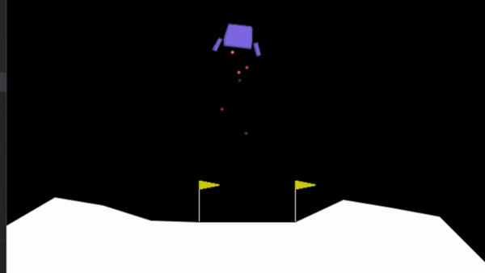
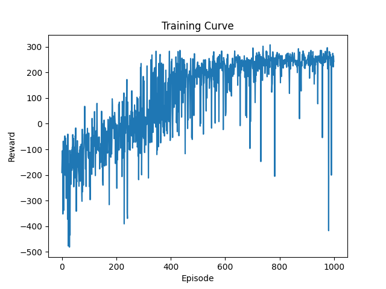
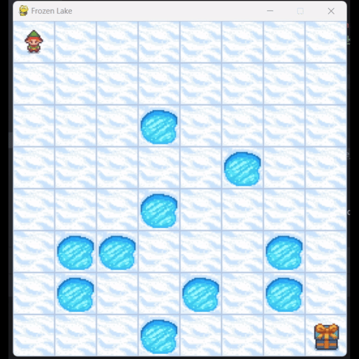

# Reinforcement Learning

## Implemented Algorithms
- [x] DQN
- [x] DDPG
- [ ] PPO
- [ ] SAC
- [ ] TD3

## DQN (Deep Q Learning)

### Example: 

1. [LunarLander-v2](https://gymnasium.farama.org/environments/box2d/lunar_lander/)

   #### Before Training
   
   #### After Training
   
   #### Training curve
   
2. [FrozenLake-v1(8x8 map)](https://gymnasium.farama.org/environments/toy_text/frozen_lake/)
   #### Before Training
   .gif)
   #### After Training
   
